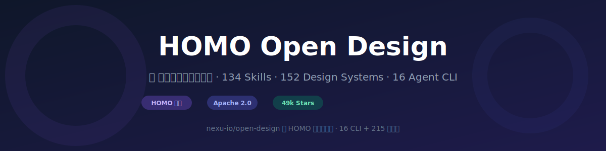

<p align="center">
  
</p>

<p align="center">
  <a href="https://github.com/sevenliuhu/homo-open-design/stargazers"></a>
  <a href="https://github.com/sevenliuhu/homo-open-design/network/members"></a>
  <a href="LICENSE"></a>
  <a href="#homo-集成"></a>
  <a href="#设计系统"></a>
  <a href="#技能引擎"></a>
  <a href="#agent-cli"></a>
</p>

<p align="center">
  <b>简体中文</b>
</p>

---

# 🎨 HOMO Open Design — 开源设计引擎中文版

> **HOMO Open Design** 是 [nexu-io/open-design](https://github.com/nexu-io/open-design)（49144⭐）的 HOMO 集成增强版。
>
> 将 134 个设计技能、152 套品牌设计系统、16 套 Agent CLI 检测协议，**全面适配接入 HOMO 215 个智能体系统**。

---

## ✨ 这是什么

**Open Design** 是 Anthropic Claude Design 的开源替代品——一个本地优先、skill 驱动的设计工作流引擎。它不做 agent，而是**接入你已经装好的 coding agent**，让它们像资深设计师一样工作。

**HOMO Open Design** 在原始项目基础上，增加了：

| | 原始 Open Design | HOMO Open Design |
|---|---|---|
| **Agent 接入** | 16 套 CLI 自动检测 | 16 CLI + **HOMO 215 个智能体** |
| **技能体系** | SKILL.md 独立协议 | SKILL.md + **HOMO 部门技能格式双协议** |
| **设计系统** | 152 套 DESIGN.md | 152 套 DESIGN.md + **HOMO 品牌资产映射** |
| **组织架构** | 技能平铺 | **10+ 部门、100+ 技能部门**层次化管理 |
| **迭代机制** | 手动更新 | **情报自动抓取 + 每日迭代** |
| **部署** | daemon + web | daemon + web + **HOMO 运行时适配层** |

---

## 🚀 核心能力

### 16 Agent CLI 自动检测

支持在 `PATH` 上自动发现以下 agent：

| CLI | 类型 | 状态 |
|---|---|---|
| Claude Code | Anthropic | ✅ |
| Codex CLI | OpenAI | ✅ |
| Devin for Terminal | Cognition | ✅ |
| Cursor Agent | Cursor | ✅ |
| Gemini CLI | Google | ✅ |
| OpenCode | Open Source | ✅ |
| Qwen Code | Alibaba | ✅ |
| Qoder CLI | Alibaba | ✅ |
| GitHub Copilot CLI | GitHub | ✅ |
| Hermes (ACP) | Open Source | ✅ |
| Kimi CLI (ACP) | Moonshot | ✅ |
| Pi (RPC) | Inflection | ✅ |
| Kiro CLI (ACP) | Kiro | ✅ |
| Kilo (ACP) | Kilo | ✅ |
| Mistral Vibe CLI (ACP) | Mistral | ✅ |
| DeepSeek TUI | DeepSeek | ✅ |
| **HOMO 215 智能体** | HOMO 平台 | **🆕** |

### 134 个设计技能

覆盖 15+ 场景分类：

- **原型设计** — 落地页、SaaS、仪表盘、移动端、社交卡片……
- **演示文稿** — 杂志风 PPT、极简 Deck、投资人 Pitch……
- **设计系统** — 品牌创建、设计评审、设计规范……
- **图像生成** — GPT-Image、Imagen、Venice、FAL……
- **视频制作** — Sora、Seedance、Kling、HyperFrames……
- **前端开发** — Shadcn UI、ThreeJS、GSAP、React……
- **品牌创意** — 设计咨询、创意指导、文案撰写……
- **数据分析** — 信息图、数据报表、财报设计……

### 152 套品牌设计系统

从 Linear、Stripe、Apple、Notion 到 Ant Design、小红书——每套自带 9 段式 DESIGN.md 格式：

```yaml
Visual Theme     → 视觉主题与氛围
Color Palette    → 色板与角色分工
Typography       → 字体规则（比例尺 / 行高 / 字距）
Components       → 组件样式指南
Layout           → 布局原则
Depth & Elevation → 深度与层级
Do's & Don'ts    → 设计戒律
Responsive       → 响应式行为
Agent Guide      → Agent 提示指南
```

---

## 🔌 HOMO 集成

HOMO 215 个智能体分为 10+ 部门，每个部门下辖多个技能部门。本项目的适配层将 Open Design 的 SKILL.md 协议无缝桥接到 HOMO 部门技能格式。

### 适配架构

```
┌─────────────────────────────────┐
│     HOMO 运行时 (215 智能体)      │
├─────────────────────────────────┤
│        HOMO 技能适配层            │  ← adapter/
│   (SKILL.md ↔ 部门技能格式转换)    │
├────────────────┬────────────────┤
│  16 CLI 检测    │  HOMO 协议桥   │
├────────────────┴────────────────┤
│       Open Design 引擎           │
│   ┌──────┬──────┬──────────┐   │
│   │Skills│Design│  Craft   │   │
│   │134个 │ 系统  │  工艺规则 │   │
│   │      │152套 │          │   │
│   └──────┴──────┴──────────┘   │
└─────────────────────────────────┘
```

### 快速接入

```bash
# 1. 克隆本项目
git clone https://github.com/sevenliuhu/homo-open-design.git
cd homo-open-design

# 2. 安装依赖
pnpm install

# 3. 启动开发环境
pnpm tools-dev run web

# 4. 激活 HOMO 适配层
homo skill install ./adapter/homo-skill-adapter.homo

# 5. 体验
# 打开浏览器 → 选技能 → 写需求 → 自动生成为所欲为的设计
```

### HOMO 部门映射示例

| Open Design 技能 | HOMO 部门 | HOMO 技能部门 |
|---|---|---|
| saas-landing | 产品设计部 | 落地页设计组 |
| dashboard | 产品设计部 | 数据可视化组 |
| magazine-poster | 品牌创意部 | 平面设计组 |
| pitch-deck | 商务拓展部 | 提案设计组 |
| ui-ux-pro-max | 用户体验部 | 界面设计组 |
| shadcn-ui | 前端工程部 | 组件研发组 |
| d3-visualization | 数据分析部 | 可视化呈现组 |
| copywriting | 文案策划部 | 创意文案组 |

---

## 📦 项目结构

```
homo-open-design/
├── README.md                 ← 本文件
├── adapter/                  ← HOMO 适配层
│   ├── homo-skill-adapter.homo   ← 部门技能格式适配器
│   ├── homo-skill-adapter.schema ← 格式转换 Schema
│   └── department-mapping.yaml   ← 部门映射配置
├── skills/                   ← SKILL.md 适配版（134 个）
│   ├── saas-landing/
│   ├── magazine-poster/
│   ├── pitch-deck/
│   └── ...
├── design-systems/           ← 设计系统（152 套）
│   ├── linear/
│   ├── stripe/
│   ├── apple/
│   └── ...
├── craft/                    ← 通用工艺规则
│   ├── typography.md
│   ├── color.md
│   └── anti-ai-slop.md
├── cli/                      ← CLI 检测与调试工具
│   └── homo-detect            ← HOMO 智能体检测脚本
└── examples/                 ← 使用示例
    ├── 01-saas-landing.md
    ├── 02-magazine-deck.md
    └── 03-brand-system.md
```

---

## 🎯 快速开始

### 前提条件

- Node.js 24+
- pnpm 10.x
- 任意一个 Agent CLI（Claude Code / Codex / Cursor Agent 等）
- （可选）HOMO 运行时

### 5 分钟上手

```bash
# 安装依赖
corepack enable
pnpm install

# 启动 daemon + web
pnpm tools-dev run web
# → 浏览器打开 http://127.0.0.1:5173

# 选择一个技能，输入：
"帮我设计一个 SaaS 着陆页，产品是 AI 客服助手"

# 等待 Agent 完成 → 预览结果 → 导出
```

### 使用 HOMO 适配

```bash
# 确保 HOMO 运行时已安装
# 安装适配器
homo skill install ./adapter/homo-skill-adapter.homo

# 通过 HOMO 使用设计引擎
homo run "帮我做一份杂志风 8 页投资人 Pitch Deck"
```

---

## 🏗️ 架构细节

### SKILL.md 协议（部门技能格式）

```yaml
---
name: saas-landing
description: 单页 SaaS 着陆页，含 hero、功能、社交信任、定价、CTA
triggers:
  - "saas landing"
  - "marketing page"
  - "着陆页"

# HOMO 扩展字段
od:
  mode: prototype
  preview:
    type: html
    entry: index.html
  design_system:
    requires: true
    sections: [color, typography, layout, components]
  homo:
    department: 产品设计部         # 所属 HOMO 部门
    skill_group: 着陆页设计组       # 所属技能部门
    category: 原型设计              # 场景分类
    ai_required: 1                 # 需要的智能体并行数
---

# Workflow

1. 读取 DESIGN.md，采用品牌色板/字体/布局规则
2. 复制 `assets/base.html` 到 cwd 的 `index.html`
3. 填充各区块：hero、功能（3-6个）、社交信任、定价、CTA、footer
4. 内联所有 CSS
5. 写入 `index.html`
```

### Multi-Agent CLI 检测

根据 [`agent-adapters.md`](https://github.com/nexu-io/open-design/blob/main/docs/agent-adapters.md)，Open Design 的核心创新之一是在 `$PATH` 上自动检测已安装的 agent，为每个 agent 准备正确的 spawn 参数（适配器模式），daemon 只作为编排层。

HOMO 适配层在此基础上增加：

- **HOMO 智能体发现** — 扫描 HOMO 运行时注册的 215 个智能体
- **部门路由** — 根据 SKILL.md 的 `homo.department` 字段智能路由
- **并行编排** — 支持多智能体并行协作

---

## 📋 路线图

- [x] 核心 SKILL.md 协议提取
- [x] 134 技能部门化分类
- [x] 152 设计系统标准化
- [x] 16 Agent CLI 检测适配
- [ ] HOMO 智能体并行编排
- [ ] Web UI 部门管理面板
- [ ] 设计系统自动生成
- [ ] 社区技能市场

---

## 🤝 贡献

欢迎提 PR 和 Issue！详细请见 [CONTRIBUTING.md](CONTRIBUTING.md)。

---

## ⚠️ 协议说明

- 本项目基于 [Apache-2.0](LICENSE) 协议
- 原始 Open Design 项目 © nexu-io，Apache-2.0
- **HOMO 核心代码和专利**不包含在本项目内
- **商用必须联系获取授权**

---

## 📬 联系方式

- 📧 16208204@qq.com
- 🌐 [GitHub Issues](https://github.com/sevenliuhu/homo-open-design/issues)

---

## ⭐ Star History

<p align="center">
  <b>如果你觉得这个项目有帮助，请给它一个 ⭐！</b>
</p>
